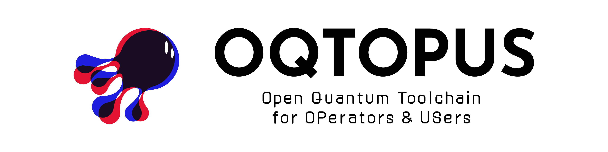

<!-- markdownlint-disable MD041 -->

# oqtopus-auth

## Overview

**OQTOPUS Auth** is a framework-agnostic authentication and authorization
library for the OQTOPUS ecosystem. It ships pluggable authentication
providers (disabled auth, and reverse-proxy-injected JWT headers) plus a
role/permission model, with an optional FastAPI integration.

## Features

- **Pluggable providers**: `none` (disabled auth) and `header` (JWT read
  from a reverse-proxy-injected header, with optional JWKS signature
  verification).
- **Framework-agnostic core**: providers, configuration models, and
  permission checks have no dependency on any web framework.
- **Optional FastAPI integration**: middleware and `Depends`-based role and
  permission checks, installed via the `fastapi` extra.

## Usage

- [Getting Started](./usage/getting_started.md)
- [Authentication](./usage/authentication.md)

## API reference

- [API reference](./reference/API_reference.md)

## Developer Guidelines

- [Development Flow](./developer_guidelines/development_flow.md)
- [Setup Development Environment](./developer_guidelines/setup.md)
- [How to Contribute](./CONTRIBUTING.md)
- [Code of Conduct](https://github.com/oqtopus-team/.github/blob/main/CODE_OF_CONDUCT.md)
- [Security](https://github.com/oqtopus-team/.github/blob/main/SECURITY.md)

## Citation

You can use the DOI to cite oqtopus-auth in your research.

Citation information is also available in the [CITATION](https://github.com/oqtopus-team/oqtopus-auth/blob/main/CITATION.cff) file.

## Contact

You can contact us by creating an issue in this repository or by email:

- [oqtopus-team[at]googlegroups.com](mailto:oqtopus-team[at]googlegroups.com)

## License

oqtopus-auth is released under the [Apache License 2.0](https://github.com/oqtopus-team/oqtopus-auth/blob/main/LICENSE).
